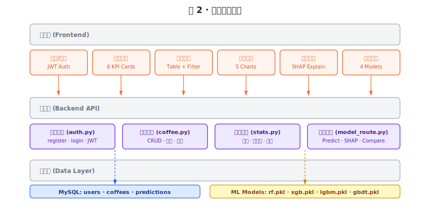
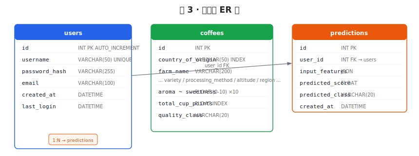
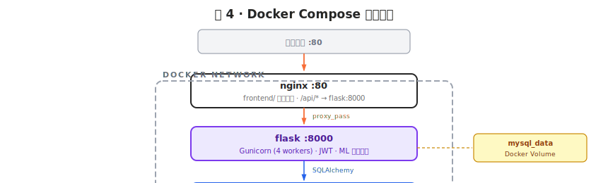

# 全球咖啡品质评级系统 — 实验报告

> 云计算期末大作业 · Flask + MySQL + 多模型对比 + Docker Compose 部署

---

## 一、项目概述

### 1.1 选题背景

本系统基于 **CQI（Coffee Quality Institute）全球咖啡品质数据库**，构建一个集数据浏览、多维分析、机器学习预测于一体的 Web 应用平台。用户可通过浏览器注册登录，浏览 37 个国家的咖啡品质数据，利用多维度图表进行探索性分析，并使用训练好的机器学习模型预测咖啡品质评分。

### 1.2 核心功能

| 模块 | 功能 |
|------|------|
| 用户认证 | 注册 / 登录 / JWT Token 鉴权 |
| 数据概览 | 6 维统计卡片 + Top10 国家柱状图 + 等级环形图 + 分数分布 |
| 数据浏览 | 筛选(国家/品种/等级) + 排序 + 分页 + 行详情风味雷达图 |
| 数据分析 | 国家对比 / 品质等级 / 相关性热力图 / 特征重要性 / 海拔散点图 + 自动洞察 |
| 模型预测 | 11 维感官参数输入 + 4 模型可选 + 仪表盘结果 + SHAP 特征贡献 |
| 模型对比 | 4 模型 R² / RMSE 对比柱状图 + 指标卡片 + 特征重要性 |
| 预测历史 | 分页查看 + 详情弹窗 + 删除功能 |

---

## 二、技术选型

| 层次 | 技术 | 版本 | 选型理由 |
|------|------|------|----------|
| 后端框架 | Flask + SQLAlchemy | 3.1 | 轻量灵活，ORM 操作 MySQL |
| 数据库 | MySQL | 8.0 | 表格结构数据，SQL 聚合统计(GROUP BY/AVG)天然优势 |
| 前端 | 原生 HTML/CSS/JS + ECharts | 5.5 | 无构建步骤，ECharts 支持雷达图/热力图/仪表盘 |
| ML 框架 | scikit-learn + XGBoost + LightGBM | 1.7 / 3.2 / 4.6 | 多模型对比，GridSearchCV 调参 |
| 可解释性 | SHAP | 0.51 | 特征贡献分析，解释预测结果 |
| 认证 | JWT (flask-jwt-extended) | 4.7 | 无状态 Token 认证 |
| 部署 | Docker Compose | 3.8 | Flask + MySQL + Nginx 三容器编排 |

---

## 三、系统架构

### 3.1 总体架构图


### 3.2 功能模块架构

<svg xmlns="http://www.w3.org/2000/svg" width="860" height="420" font-family="Poppins,Microsoft YaHei,sans-serif" font-size="13">
  <defs>
    <marker id="arr-call" viewBox="0 0 10 7" markerWidth="10" markerHeight="7" refX="8.5" refY="3.5" orient="auto" markerUnits="userSpaceOnUse" overflow="visible">
      <polygon points="0 0,10 3.5,0 7" fill="#6b7280"/>
    </marker>
    <marker id="arr-data" viewBox="0 0 10 7" markerWidth="10" markerHeight="7" refX="8.5" refY="3.5" orient="auto" markerUnits="userSpaceOnUse" overflow="visible">
      <polygon points="0 0,10 3.5,0 7" fill="#f76d37"/>
    </marker>
    <marker id="arr-sql" viewBox="0 0 10 7" markerWidth="10" markerHeight="7" refX="8.5" refY="3.5" orient="auto" markerUnits="userSpaceOnUse" overflow="visible">
      <polygon points="0 0,10 3.5,0 7" fill="#2563eb"/>
    </marker>
    <marker id="arr-gold" viewBox="0 0 10 7" markerWidth="10" markerHeight="7" refX="8.5" refY="3.5" orient="auto" markerUnits="userSpaceOnUse" overflow="visible">
      <polygon points="0 0,10 3.5,0 7" fill="#ca8a04"/>
    </marker>
  </defs>

  <text x="430" y="26" text-anchor="middle" font-size="17" font-weight="bold" fill="#252525">图 2 · 功能模块架构</text>

  <!-- Frontend layer -->
  <rect x="60" y="48" width="740" height="42" rx="6" fill="#f3f4f6" stroke="#9ca3af" stroke-width="1.2"/>
  <text x="80" y="74" font-size="12" font-weight="bold" fill="#6b7280">表现层 (Frontend)</text>

  <!-- Frontend boxes -->
  <rect x="60" y="100" width="115" height="50" rx="6" fill="#fff4ee" stroke="#f76d37" stroke-width="1.5"/>
  <text x="117" y="120" text-anchor="middle" font-size="11" font-weight="bold" fill="#f76d37">登录/注册</text>
  <text x="117" y="137" text-anchor="middle" font-size="10" fill="#d85521">JWT Auth</text>

  <rect x="185" y="100" width="115" height="50" rx="6" fill="#fff4ee" stroke="#f76d37" stroke-width="1.5"/>
  <text x="242" y="120" text-anchor="middle" font-size="11" font-weight="bold" fill="#f76d37">数据概览</text>
  <text x="242" y="137" text-anchor="middle" font-size="10" fill="#d85521">6 KPI Cards</text>

  <rect x="310" y="100" width="115" height="50" rx="6" fill="#fff4ee" stroke="#f76d37" stroke-width="1.5"/>
  <text x="367" y="120" text-anchor="middle" font-size="11" font-weight="bold" fill="#f76d37">数据浏览</text>
  <text x="367" y="137" text-anchor="middle" font-size="10" fill="#d85521">Table + Filter</text>

  <rect x="435" y="100" width="115" height="50" rx="6" fill="#fff4ee" stroke="#f76d37" stroke-width="1.5"/>
  <text x="492" y="120" text-anchor="middle" font-size="11" font-weight="bold" fill="#f76d37">数据分析</text>
  <text x="492" y="137" text-anchor="middle" font-size="10" fill="#d85521">5 Charts</text>

  <rect x="560" y="100" width="115" height="50" rx="6" fill="#fff4ee" stroke="#f76d37" stroke-width="1.5"/>
  <text x="617" y="120" text-anchor="middle" font-size="11" font-weight="bold" fill="#f76d37">模型预测</text>
  <text x="617" y="137" text-anchor="middle" font-size="10" fill="#d85521">SHAP Explain</text>

  <rect x="685" y="100" width="115" height="50" rx="6" fill="#fff4ee" stroke="#f76d37" stroke-width="1.5"/>
  <text x="742" y="120" text-anchor="middle" font-size="11" font-weight="bold" fill="#f76d37">模型对比</text>
  <text x="742" y="137" text-anchor="middle" font-size="10" fill="#d85521">4 Models</text>

  <!-- Arrows down -->
  <line x1="117" y1="150" x2="117" y2="190" stroke="#f76d37" stroke-width="1.3" marker-end="url(#arr-data)"/>
  <line x1="242" y1="150" x2="242" y2="190" stroke="#f76d37" stroke-width="1.3" marker-end="url(#arr-data)"/>
  <line x1="367" y1="150" x2="367" y2="190" stroke="#f76d37" stroke-width="1.3" marker-end="url(#arr-data)"/>
  <line x1="492" y1="150" x2="492" y2="190" stroke="#f76d37" stroke-width="1.3" marker-end="url(#arr-data)"/>
  <line x1="617" y1="150" x2="617" y2="190" stroke="#f76d37" stroke-width="1.3" marker-end="url(#arr-data)"/>
  <line x1="742" y1="150" x2="742" y2="190" stroke="#f76d37" stroke-width="1.3" marker-end="url(#arr-data)"/>

  <!-- API layer -->
  <rect x="60" y="195" width="740" height="42" rx="6" fill="#f3f4f6" stroke="#9ca3af" stroke-width="1.2"/>
  <text x="80" y="221" font-size="12" font-weight="bold" fill="#6b7280">服务层 (Backend API)</text>

  <!-- Backend boxes -->
  <rect x="60" y="248" width="170" height="50" rx="6" fill="#ede9fe" stroke="#7c3aed" stroke-width="1.5"/>
  <text x="145" y="268" text-anchor="middle" font-size="11" font-weight="bold" fill="#4c1d95">认证服务 (auth.py)</text>
  <text x="145" y="285" text-anchor="middle" font-size="10" fill="#5b21b6">register · login · JWT</text>

  <rect x="245" y="248" width="170" height="50" rx="6" fill="#ede9fe" stroke="#7c3aed" stroke-width="1.5"/>
  <text x="330" y="268" text-anchor="middle" font-size="11" font-weight="bold" fill="#4c1d95">数据服务 (coffee.py)</text>
  <text x="330" y="285" text-anchor="middle" font-size="10" fill="#5b21b6">CRUD · 分页 · 筛选</text>

  <rect x="430" y="248" width="170" height="50" rx="6" fill="#ede9fe" stroke="#7c3aed" stroke-width="1.5"/>
  <text x="515" y="268" text-anchor="middle" font-size="11" font-weight="bold" fill="#4c1d95">统计服务 (stats.py)</text>
  <text x="515" y="285" text-anchor="middle" font-size="10" fill="#5b21b6">聚合 · 相关性 · 洞察</text>

  <rect x="615" y="248" width="185" height="50" rx="6" fill="#ede9fe" stroke="#7c3aed" stroke-width="1.5"/>
  <text x="707" y="268" text-anchor="middle" font-size="11" font-weight="bold" fill="#4c1d95">模型服务 (model_route.py)</text>
  <text x="707" y="285" text-anchor="middle" font-size="10" fill="#5b21b6">Predict · SHAP · Compare</text>



  <text x="615" y="150" fill="#111827" font-family="monospace" font-size="11">input_features</text><text x="700" y="150" fill="#6f6f6f" font-size="10">JSON</text>
  <line x1="610" y1="156" x2="825" y2="156" stroke="#e9e9e9" stroke-width="0.5"/>

  <text x="615" y="174" fill="#111827" font-family="monospace" font-size="11">predicted_score</text><text x="700" y="174" fill="#6f6f6f" font-size="10">FLOAT</text>
  <line x1="610" y1="180" x2="825" y2="180" stroke="#e9e9e9" stroke-width="0.5"/>

  <text x="615" y="198" fill="#111827" font-family="monospace" font-size="11">predicted_class</text><text x="700" y="198" fill="#6f6f6f" font-size="10">VARCHAR(20)</text>
  <line x1="610" y1="204" x2="825" y2="204" stroke="#e9e9e9" stroke-width="0.5"/>

  <text x="615" y="222" fill="#111827" font-family="monospace" font-size="11">created_at</text><text x="700" y="222" fill="#6f6f6f" font-size="10">DATETIME</text>

  <!-- FK arrow: users → predictions -->
  <line x1="270" y1="155" x2="598" y2="130" stroke="#6b7280" stroke-width="1.2" marker-end="url(#er-ref)"/>
  <text x="420" y="138" font-size="10" fill="#6f6f6f">user_id FK</text>
</svg>

### 3.4 Docker 部署架构

<svg xmlns="http://www.w3.org/2000/svg" width="860" height="260" font-family="Poppins,Microsoft YaHei,sans-serif" font-size="13">
  <defs>
    <marker id="d-http" viewBox="0 0 10 7" markerWidth="10" markerHeight="7" refX="8.5" refY="3.5" orient="auto" markerUnits="userSpaceOnUse" overflow="visible">
      <polygon points="0 0,10 3.5,0 7" fill="#f76d37"/>
    </marker>
    <marker id="d-tcp" viewBox="0 0 10 7" markerWidth="10" markerHeight="7" refX="8.5" refY="3.5" orient="auto" markerUnits="userSpaceOnUse" overflow="visible">
      <polygon points="0 0,10 3.5,0 7" fill="#2563eb"/>
    </marker>
  </defs>

  <text x="430" y="26" text-anchor="middle" font-size="17" font-weight="bold" fill="#252525">图 4 · Docker Compose 容器架构</text>

  <!-- External -->
  <rect x="280" y="42" width="300" height="34" rx="6" fill="#f3f4f6" stroke="#9ca3af" stroke-width="1.2"/>
  <text x="430" y="64" text-anchor="middle" font-size="11" font-weight="bold" fill="#6b7280">外部访问 :80</text>

  <line x1="430" y1="76" x2="430" y2="100" stroke="#f76d37" stroke-width="1.8" marker-end="url(#d-http)"/>

  <!-- Nginx container -->
  <rect x="270" y="105" width="320" height="48" rx="8" fill="#fff" stroke="#252525" stroke-width="2"/>
  <text x="430" y="126" text-anchor="middle" font-weight="bold" fill="#252525">nginx :80</text>
  <text x="430" y="143" text-anchor="middle" font-size="10" fill="#6f6f6f">frontend/ 静态文件 · /api/* → flask:8000</text>

  <line x1="430" y1="153" x2="430" y2="176" stroke="#f76d37" stroke-width="1.8" marker-end="url(#d-http)"/>
  <text x="442" y="168" font-size="9" fill="#f76d37">proxy_pass</text>

  <!-- Flask container -->
  <rect x="270" y="180" width="320" height="48" rx="8" fill="#ede9fe" stroke="#7c3aed" stroke-width="2"/>
  <text x="430" y="201" text-anchor="middle" font-weight="bold" fill="#4c1d95">flask :8000</text>
  <text x="430" y="218" text-anchor="middle" font-size="10" fill="#5b21b6">Gunicorn (4 workers) · JWT · ML 模型服务</text>

  <line x1="430" y1="228" x2="430" y2="256" stroke="#2563eb" stroke-width="1.5" marker-end="url(#d-tcp)"/>
  <text x="442" y="245" font-size="9" fill="#2563eb">SQLAlchemy</text>

  <!-- MySQL container -->
  <rect x="270" y="260" width="320" height="48" rx="8" fill="#dbeafe" stroke="#2563eb" stroke-width="2"/>
  <text x="430" y="281" text-anchor="middle" font-weight="bold" fill="#1e3a8a">mysql :3306</text>
  <text x="430" y="298" text-anchor="middle" font-size="10" fill="#1e40af">数据卷持久化 · 初始化 SQL 自动执行</text>

  <!-- Docker boundary -->
  <rect x="220" y="115" width="420" height="230" rx="10" fill="none" stroke="#9ca3af" stroke-width="2" stroke-dasharray="8,4"/>
  <text x="230" y="110" font-size="11" font-weight="bold" fill="#6b7280" letter-spacing="2">DOCKER NETWORK</text>

  <!-- Volumes -->
  <rect x="670" y="190" width="160" height="40" rx="6" fill="#fef9c3" stroke="#ca8a04" stroke-width="1.2"/>
  <text x="750" y="207" text-anchor="middle" font-size="10" font-weight="bold" fill="#92400e">mysql_data</text>
  <text x="750" y="222" text-anchor="middle" font-size="9" fill="#78350f">Docker Volume</text>
  <line x1="590" y1="210" x2="668" y2="210" stroke="#ca8a04" stroke-width="1.2" stroke-dasharray="4,3"/>
</svg>

---

## 四、数据库设计

### 4.1 核心表结构

**users** — 用户认证表

| 字段 | 类型 | 约束 | 说明 |
|------|------|------|------|
| id | INT | PK AUTO_INCREMENT | 主键 |
| username | VARCHAR(50) | UNIQUE NOT NULL | 用户名 |
| password_hash | VARCHAR(255) | NOT NULL | werkzeug 哈希密码 |
| email | VARCHAR(100) | | 邮箱 |
| created_at | DATETIME | DEFAULT NOW() | 注册时间 |
| last_login | DATETIME | | 最后登录 |

**coffees** — 咖啡品质数据表（核心表，1311 条记录）

| 字段 | 类型 | 索引 | 说明 |
|------|------|------|------|
| id | INT PK | — | 主键 |
| country_of_origin | VARCHAR(50) | INDEX | 产地国家 |

|------|------|--------|
| 1 | 风味 (Flavor) | 0.3570 |
| 2 | 干净杯 (Clean Cup) | 0.1439 |
| 3 | 余韵 (Aftertaste) | 0.1415 |
| 4 | 平衡度 (Balance) | 0.0760 |
| 5 | 酸度 (Acidity) | 0.0701 |

---

## 七、关键代码片段

### 7.1 Flask 工厂模式

```python
# backend/app.py
def create_app():
    frontend_dir = os.path.join(os.path.dirname(os.path.dirname(__file__)), "frontend")
    app = Flask(__name__, static_folder=frontend_dir, static_url_path="")
    app.config.from_object(Config)

    db.init_app(app)
    jwt.init_app(app)
    CORS(app, resources={r"/api/*": {"origins": "*"}})

    app.register_blueprint(auth_bp,   url_prefix="/api/auth")
    app.register_blueprint(coffee_bp, url_prefix="/api/coffee")
    app.register_blueprint(stats_bp,  url_prefix="/api/stats")
    app.register_blueprint(model_bp,  url_prefix="/api/model")

    @app.route("/")
    @app.route("/<path:path>")
    def serve_frontend(path=""):
        if path and os.path.exists(os.path.join(frontend_dir, path)):
            return send_from_directory(frontend_dir, path)
        return send_from_directory(frontend_dir, "index.html")
    return app
```

### 7.2 多模型训练

```python
# backend/ml/train.py (核心流程)
def train_all_models():
    df = pd.read_csv(csv_path)
    df.columns = [normalize_col(c) for c in df.columns]
    # 分类特征编码
    for col in ["country_of_origin", "variety", "processing_method"]:
        df[f"{col}_encoded"] = df[col].astype("category").cat.codes
    X, _ = prepare_features(df)
    y = df["total_cup_points"]
    X_train, X_test, y_train, y_test = train_test_split(X, y, test_size=0.2, random_state=42)

    models = {
        "rf":  RandomForestRegressor(),
        "xgb": XGBRegressor(),
        "lgbm": LGBMRegressor(),
        "gbdt": GradientBoostingRegressor(),
    }
    results = []
    for name, model in models.items():
        grid = GridSearchCV(model, PARAM_GRIDS[name], cv=5, scoring='r2')
        grid.fit(X_train, y_train)
        y_pred = grid.best_estimator_.predict(X_test)
        results.append({
            "name": name,
            "r2": r2_score(y_test, y_pred),
            "rmse": mean_squared_error(y_test, y_pred, squared=False),
            "best_params": grid.best_params_,
        })
    # 保存最优模型 + 对比 JSON
```

### 7.3 JWT 认证路由

```python
# backend/routes/auth.py
@auth_bp.route("/register", methods=["POST"])
def register():
    data = request.get_json()
    if User.find_by_username(data["username"]):
        return jsonify({"msg": "用户名已存在"}), 409
    user = User(username=data["username"], email=data.get("email"))
    user.set_password(data["password"])
    db.session.add(user); db.session.commit()
    return jsonify({"msg": "注册成功"}), 201

@auth_bp.route("/login", methods=["POST"])
def login():
    user = User.find_by_username(data["username"])
    if not user or not user.check_password(data["password"]):
        return jsonify({"msg": "用户名或密码错误"}), 401

      mysql: { condition: service_healthy }

  nginx:
    image: nginx:alpine
    ports: ["80:80"]
    volumes:
      - ./frontend:/usr/share/nginx/html
      - ./nginx/nginx.conf:/etc/nginx/conf.d/default.conf
```

---

## 八、程序运行结果

### 8.1 登录注册

- 用户名/密码验证，JWT Token 24h 有效期
- 未登录自动跳转登录页，Token 过期自动清除
- 注册成功弹窗 Toast 提示

### 8.2 数据概览

- 6 张 KPI 卡片：1311 条样本 · 平均 82.12 分 · 37 国 · 30 品种 · 最高 US 85.98 · 卓越 8.1%
- Top10 国家柱状图（橙色渐变）
- 品质等级环形图（绿/蓝/黄/橙/红 五色）
- 分数分布直方图

### 8.3 数据浏览

- 筛选下拉框：37 国 + 30 品种 + 5 等级
- 搜索框（农场名/产区模糊搜索）
- 表头点击排序（总分/香气/风味等 10 列）
- 分页（10/20/50 条切换）
- 行点击弹出详情模态框（含 8 轴风味雷达图 + 全球均值对比虚线）

### 8.4 数据分析

- 各国柱状图 Top15（点击国家跳转数据浏览并预筛选）
- 品质等级环形图（全球 / 按国家切换，自动选择器）
- 感官维度 10×10 相关性热力图（Pearson）
- 模型特征重要性排序柱状图
- 海拔 vs 品质分散点图（五色品质等级）
- 7 条自动分析洞察结论卡片

### 8.5 模型预测

- 11 维滑块+数字输入（实时同步）
- 4 模型下拉选择（随机森林 / XGBoost / LightGBM / GBDT）
- 随机填充按钮（从数据库随机取真实咖啡数据）
- 仪表盘图（0-100，五段颜色分区）
- 置信区间（仅 Random Forest 提供）
- SHAP 特征贡献瀑布图（正面/负面贡献红绿双色）

### 8.6 模型对比

- 4 张模型指标卡片（R² / RMSE / 训练时间 / 最优参数），最优模型绿框标记
- R² 柱状图（最优绿色高亮）
- RMSE 柱状图（越低越好，最优绿色高亮）
- 最优模型特征重要性横向柱状图

### 8.7 预测历史

- 分页表格（序号/时间/输入摘要/分数/等级/模型）
- 详情弹窗（完整参数 + 仪表盘图）
- 红色删除按钮（确认后删除）

---

## 九、部署流程

### 9.1 本地开发

```bash
# 1. 安装依赖
pip install -r backend/requirements.txt

# 2. 下载数据集
curl -L -o data/coffee_quality.csv \
  https://raw.githubusercontent.com/jldbc/coffee-quality-database/master/data/arabica_data_cleaned.csv

# 3. 初始化数据库
mysql -u root -p -e "CREATE DATABASE IF NOT EXISTS coffee_quality_db"
python -c "from backend.app import create_app; from backend.extensions import db; \
           app=create_app(); app.app_context().push(); db.create_all()"

# 4. 导入数据 + 训练模型
python backend/scripts/import_data.py
python backend/ml/train.py

# 5. 启动
python -c "from backend.app import create_app; app=create_app(); app.run(host='0.0.0.0', port=5000)"
```

### 9.2 Docker 部署 (Ubuntu 云服务器)

```bash
sudo apt install -y docker.io docker-compose
git clone https://github.com/uMemory/Coffee.git && cd Coffee
curl -L -o data/coffee_quality.csv \
  https://raw.githubusercontent.com/jldbc/coffee-quality-database/master/data/arabica_data_cleaned.csv
sudo docker compose up -d --build
sudo docker exec -it coffee-flask bash -c \
  "python backend/scripts/import_data.py && python backend/ml/train.py"
# 访问 http://<服务器IP>
```

---

## 十、总结

本系统完整实现了云计算课程要求的全部功能：

1. **后端**：Flask RESTful API + MySQL 数据库 + JWT 认证 + 4 模型 ML 服务
2. **前端**：SPA 架构 + ECharts 可视化（柱状图/环形图/雷达图/热力图/散点图/仪表盘）+ 响应式布局
3. **ML**：Random Forest / XGBoost / LightGBM / GBDT 四模型 GridSearchCV 调参对比，R² 最高达 0.9732
4. **可解释性**：SHAP 特征贡献分析
5. **部署**：Docker Compose 三容器编排（Nginx + Flask/Gunicorn + MySQL），一键启动

项目源码已托管于 GitHub，报告包含完整的架构图、功能模块图、ER 图、Docker 部署架构图。
